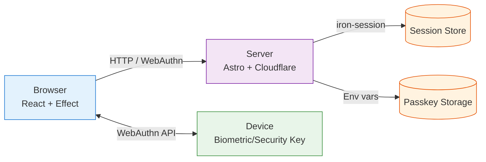
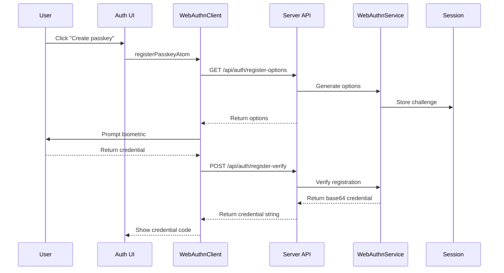
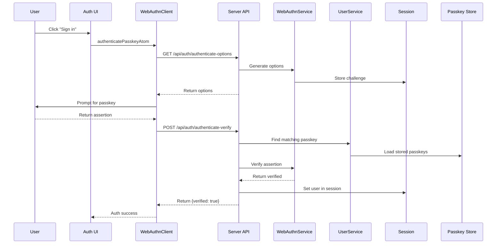
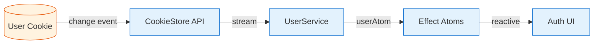

# Authentication System Architecture

This document describes how passkey authentication works in the Kiln Notes application.

## System Overview

## Registration Flow

## Authentication Flow

## Session Detection Flow

## Storage & Sessions

- **User/Passkey Storage**: Credentials are stored in environment variables (`PASSKEY_<user>`)
- **Session**: Uses `iron-session` for secure, encrypted session cookies (temporary challenge storage)
- **User Cookie**: A persistent cookie with 1-year expiry tracks logged-in state
- **Detection**: Client uses the CookieStore API to reactively detect authentication state changes

## Security Considerations

- Sessions are encrypted with a secret (`SESSION_SECRET`)
- Cookies use `sameSite: strict` and `secure: true` settings
- WebAuthn provides phishing-resistant authentication
- Credentials are backed up by the user's authenticator (device-dependent)
